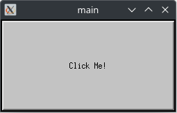
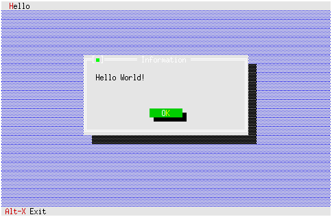
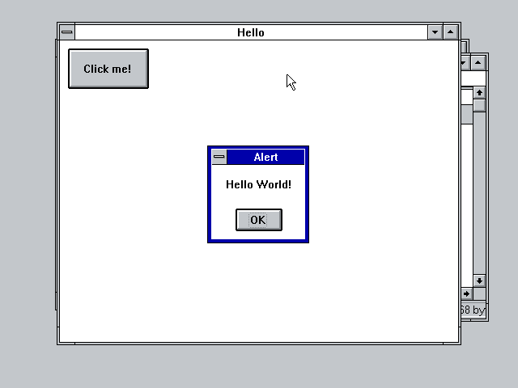
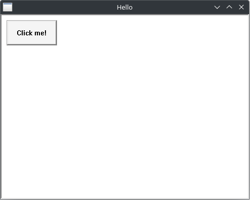

# gui-hello-world

|   |   |   |
|---|---|---|
|  |  |  |
|  |  |  |

Naive implementations of "Hello World" in various GUI toolkits.

## Toolkits

- [GTK4](./gtk4/)
- [Haiku/BeAPI](./haiku/)
- [X11/Motif](./motif/)
- [Borland TurboVision](./tvision/)
- [Win32](./win32/)
