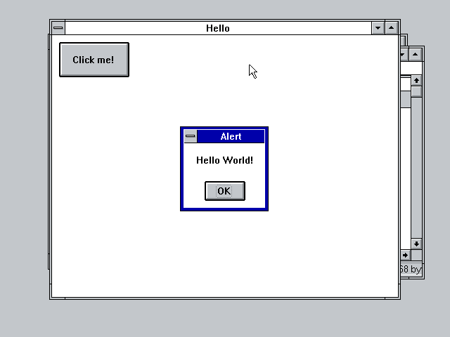
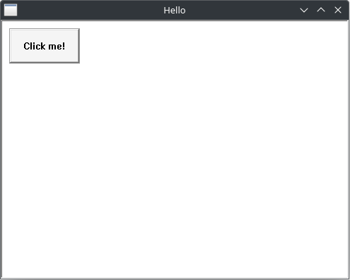
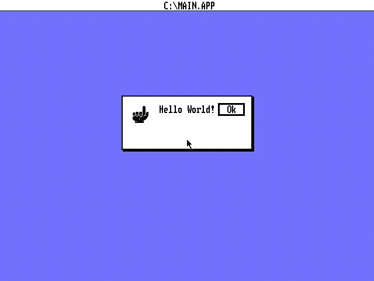

# gui-hello-world

Naive implementations of "Hello World" in various GUI toolkits.

|   |   |   |
|---|---|---|
| [   **GTK4**](./gtk4/) | [   **Haiku/BeAPI**](./haiku/) | [   **X11/Motif**](./motif/) |
| [   **Borland TurboVision**](./tvision/) | [   **WinAPI (Windows 3.11)**](./winapi/) | [   **WinAPI (Wine)**](./winapi/) |
| [   **Digital Research GEM**](./gem/) | | |
